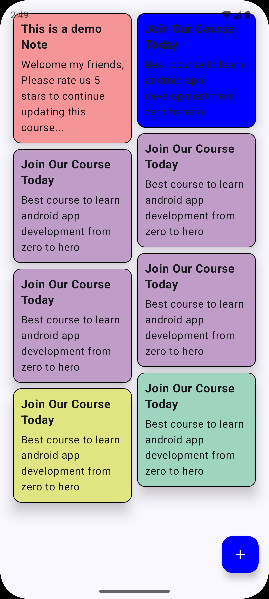

# notey-app
# 📝 Note Application (MVVM + Room)

A simple Android **Note Application** built using **MVVM architecture** and **Room Database**.  
This app allows users to create, update, delete, and store notes locally in an efficient and clean way.

---

## 📱 Features

- Create notes
- Edit notes
- Delete notes
- Offline storage using Room
- Live UI updates with LiveData
- Clean and scalable MVVM architecture

---

## 🏗 Architecture

The app follows **MVVM (Model–View–ViewModel)** architecture.


### Benefits
- Separation of concerns
- Lifecycle-aware components
- Easier testing and maintenance

---

## 🧰 Tech Stack

- **Language:** Kotlin
- **Architecture:** MVVM
- **Database:** Room
- **UI:** XML
- **Jetpack Components:**
    - ViewModel
    - LiveData
    - Room
- **Build Tool:** Gradle

---

## 🗃 Room Database

- **Entity:** NoteEntity
- **DAO:** NoteDao
- **Database:** NoteDatabase

Room handles SQLite operations and background threading automatically.

---

## 🚀 Getting Started

### Requirements
- Android Studio
- Android SDK 21+

### Setup
1. Clone the repository
   ```bash
   git clone https://github.com/oganaa2472/notey-app.git

## 📸 Screenshots

### Gana Oyun (Android Developer)
- Focused on clean architecture and modern Android development
